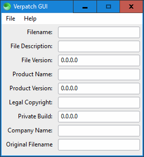

# Verpatch GUI

A graphical user interface for [verpatch](https://www.codeproject.com/Articles/37133/Simple-Version-Resource-Tool-for-Windows), a program that allows modifying an executable's metadata (such as version info and copyright).

## Preview

## Usage

1. Place [verpatch.exe](https://github.com/egorovsa/node-verpatch/tree/master/bin) inside this folder.

2. Place [scapp.exe](https://github.com/c-smile/sciter-sdk/tree/master/bin.win/x64) inside this folder.

3. Run `scapp.exe`.